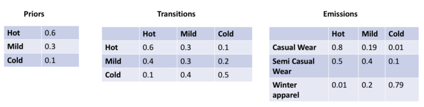

[原文《Hidden Markov Models Simplified》](https://medium.com/@postsanjay/hidden-markov-models-simplified-c3f58728caab)

Hidden Markov Models 是一种概率图模型，能够预测观测数据中未知的隐含变量。典型例子如根据着装（观测数据）推测天气（隐含变量）。HMM可视为一种特殊的贝叶斯网络，以预测最佳隐藏状态序列。


在盒子X1、X2、X3中包含球y1、y2、y3、y4。从盒子中随机的拿出球，根据观察到球的序列，推测是从拿出球的盒子的顺序。

马尔可夫过程的假设很简单，即“未来与过去无关，只和现在有关”。换句话说，我们只要知道当前的状态，不需要知道历史状态就能预测未来的状态。


1. **Transition data** — 当前状态转移到新状态的概率。
2. **Emission data** — 隐藏状态到观测数据间的转移概率。
3. **Prior probability** — 转换到隐藏状态的初始概率。

以上数据可以通过训练数据计算的出。



一旦这些信息已知，那么通过条件概率链规则和马尔可夫假设，序列的联合概率用如下公式P(Y)表示。


注意，随着观察状态和隐藏状态数量的增加，计算变得更加困难。如果每个隐藏序列有k个可能值，并且序列长度为n，则有n^k个可能的序列需要被评分和排序，才能确定最佳序列。

## 隐马尔可夫模型的变体— HMM EM

隐藏状态的概率分布并不总是已知的。在这种情况下，我们使用期望最大化（EM）模型来确定隐藏状态分布。一种流行的算法是Baum-Welch算法（[https://en.wikipedia.org/wiki/Baum%E2%80%93Welch_algorithm](https://en.wikipedia.org/wiki/Baum–Welch_algorithm)）

## 动态规划和求和规则入门

### 动态规划

从以上有关HMM的章节中可以看出，随着序列长度和隐藏状态的可能值变大，计算变得棘手。已经发现，使用动态编程可以有效地解决对HMM序列评分的问题，可视为一种**缓存的递归。**

## 给定观察序列给已知序列评分


$$
P(A,B,A,Red,Green,Red)=
$$

$$
[P(y_0=A) *P(x_0=Red/y_0=A)]* [P(y_1=B|y_0=A|) P(x_1=Green/y_1=B)]
$$

$$
*[P(y_2=A|y_1=B)* P(x_2=Red/y_2=A)]
$$

$$
=(1∗1)∗(1∗0.75)∗(1∗1)(1)(1)=(1∗1)∗(1∗0.75)∗(1∗1)
$$

$$
=0.75(2)(2)=0.75
$$

## 为可能的序列打分

假设我们需要确定一些句子（观察值）的分词（隐藏状态），我们将需要首先对每个可能的隐藏状态序列评分，然后选择最佳序列以为此确定分词。

我们将使用以下步骤对此进行评分

1. 从样本数据生成初始，过渡和发射概率分布。
2. 生成所有未知序列的列表
3. 对所有未知序列进行评分并选择最佳序列

## 生成未知序列列表

```python
# 给定状态-可能的组合数＃组合总数为（可能状态数）^（序列长度）
# 根据单字，生成所有可能词组
def generate_sequence(states, sequence_length):
  # 所有序列
  all_sequences = []
  # 递归栈
  nodes = []
  # 词组长度
  depth = sequence_length
  
  def gen_seq_recur(states, nodes, depth):
    if depth == 0:
      #print nodes
      all_sequences.append(nodes)
    else:
      for state in states:
        # 复制临时节点
        temp_nodes = list(nodes)
        temp_nodes.append(state)
        gen_seq_recur(states, temp_nodes, depth-1)
        
  gen_seq_recur(states, [], depth)
  return all_sequences
```

## 评分所有可能的序列

```python
# 评分sequence
def score_sequences(sequences,initial_probs,transition_probs,emission_probs,obs):
    best_score = -1
    best_sequence = None
    sequence_scores = []
    for seq in sequences:
        total_score = 1
        total_score_breakdown = []
        first = True
        for i in range(len(seq)):
            state_score = 1
            # 计算 transitition probability score
            if first == True:
              	# 使用第一个X节点initial probs初始化
                state_score *= initial_probs[seq[i]]
                first = False
            else:
              	# P(X_i|X(i+1))
                state_score *= transition_probs[seq[i] + "|" + seq[i-1]]
            # P(Y_i|X_i)
            state_score *= emission_probs[obs[i] + "|" + seq[i]]
            # print state score
            total_score_breakdown.append(state_score)
            # 更新 total Score
            total_score *= state_score
        sequence_scores.append(total_score)
    return sequence_scores
  
# pretty printing our  distributions
from sets import Set
import pandas as pd
from tabulate import tabulate
def pretty_print_probs(distribs):
    
    rows = Set()
    cols = Set()
    for val in distribs.keys():
        temp = val.split("|")
        rows.add(temp[0])
        cols.add(temp[1])
        
    rows = list(rows)
    cols = list(cols)
    df = []
    for i in range(len(rows)):
        temp = []
        for j in range(len(cols)):
            temp.append(distribs[rows[i]+"|"+cols[j]])
            
        df.append(temp)
        
    I = pd.Index(rows, name="rows")
    C = pd.Index(cols, name="cols")
    df = pd.DataFrame(data=df,index=I, columns=C)
    
    print tabulate(df, headers='keys', tablefmt='psql')
def initializeSequences(_obs):
    # Generate list of sequences
    
    seqLen = len(_obs)
    seqs = generate_sequence(states,seqLen)
    # Score sequences
    seq_scores = score_sequences(seqs,initial_probs,transition_probs,emission_probs,obs)
    
    return (seqLen,seqs,seq_scores)
```

## 预测最佳序列（维特比）

注意，选择最佳得分顺序也称为**维特比**得分。另一种方法是**最小贝叶斯风险**方法，该方法在所有序列得分中选择最高得分位置。

### 例子1

让我们考虑下图


```python
# 初始化数据
# generate new sequences
states = ['Noun','Verb','Determiner']
initial_probs = {'Noun':0.9,'Verb':0.05,'Determiner':0.05}
transition_probs = {'Noun|Noun':0.1,'Noun|Verb':0.1,'Noun|Determiner':0.8,
                    'Verb|Noun':0.8,'Verb|Verb':0.1,'Verb|Determiner':0.1,
                    'Determiner|Noun':0.1,'Determiner|Verb':0.8,'Determiner|Determiner':0.1}
emission_probs = {'Bob|Noun':0.9,'ate|Noun':0.05,'the|Noun':0.05,'fruit|Noun':0.9,\
                  'Bob|Verb':0.05,'ate|Verb':0.9,'the|Verb':0.05,'fruit|Verb':0.05,\
                  'Bob|Determiner':0.05,'ate|Determiner':0.05,'the|Determiner':0.9,'fruit|Determiner':0.05}
print("Initial Distributions")
print initial_probs
print("\nTransition Probabilities")
pretty_print_probs(transition_probs)
print("\nEmission Probabilities")
pretty_print_probs(emission_probs)

Initial Distributions
{'Verb': 0.05, 'Noun': 0.9, 'Determiner': 0.05}
Transition Probabilities
+------------+--------+--------+--------------+
| rows       |   Verb |   Noun |   Determiner |
|------------+--------+--------+--------------|
| Verb       |    0.1 |    0.8 |          0.1 |
| Noun       |    0.1 |    0.1 |          0.8 |
| Determiner |    0.8 |    0.1 |          0.1 |
+------------+--------+--------+--------------+
Emission Probabilities
+--------+--------+--------+--------------+
| rows   |   Verb |   Noun |   Determiner |
|--------+--------+--------+--------------|
| Bob    |   0.05 |   0.9  |         0.05 |
| fruit  |   0.05 |   0.9  |         0.05 |
| the    |   0.05 |   0.05 |         0.9  |
| ate    |   0.9  |   0.05 |         0.05 |
+--------+--------+--------+--------------+
obs = ['Bob','ate','the','fruit']
# print results
print("\nScores")
# Generate list of sequences
sequence_length,sequences,sequence_scores = initializeSequences(obs)
# Display sequence scores
for i in range(len(sequences)):
    print("Sequence:%-60s Score:%0.6f" % (sequences[i],sequence_scores[i]))
    
# Display the winning score
print("\n Best Sequence")
print(sequences[sequence_scores.index(max(sequence_scores))],max(sequence_scores))
Scores
Sequence:['Noun', 'Noun', 'Noun', 'Noun']                             Score:0.000002
Sequence:['Noun', 'Noun', 'Noun', 'Verb']                             Score:0.000001
Sequence:['Noun', 'Noun', 'Noun', 'Determiner']                       Score:0.000000
...
Sequence:['Determiner', 'Determiner', 'Determiner', 'Determiner']     Score:0.000000
 Best Sequence
(['Noun', 'Verb', 'Determiner', 'Noun'], 0.30233088000000014)
```

随着序列长度的增加耗时会花费很长时间。

## 用于计算MBR分数的向前/向后算法


*Figure — 14: HMM — Dynamic Programming — Finding the MBR Score Source: UC Berkeley lectures*

在计算某一个位置的状态可能性时，我们将计算分成2部分，第一部分alpha计算以名词结束的概率，第二部分beta计算以名词开始的概率。

```python
alpha_cache = {}
def alpha(pos,state,textList,cachedRecursion = True):
    
    if cachedRecursion == True:
        # 从缓存中返回数据
        if alpha_cache.get((pos,state)) != None:
            return alpha_cache[(pos,state)]
        
    if pos == 0:
      	# 第一个位置，根据初始概率 * P(Y_i|X_i)
        return initial_probs[state] * emission_probs[textList[pos] + "|" + state]
    else:
        total = 0
        for state_val in states:
            total += alpha(pos-1,state_val,textList,cachedRecursion) \
            * transition_probs[state+"|"+state_val] * emission_probs[textList[pos]+"|"+state]
        
        # if cache is enabled, then cache
        if cachedRecursion == True:
            if alpha_cache.get((pos,state)) == None:
                alpha_cache[(pos,state)] = total
        
        return totalbeta_cache = {}def beta(pos,state,textList,currIndex=0,currState=None,cachedRecursion = True):
    
    if cachedRecursion == True:
        
        # if cache is enabled, try to read from cache
        if beta_cache.get((currIndex,currState)) != None:
            return beta_cache[(currIndex,currState)]
        
    if currIndex == 0:
        currIndex = len(textList)
        
        if pos == currIndex - 1:
            return 1
        
        total = 0
        for state_val in states:
            tempSum = beta(pos,state,textList,currIndex-1,state_val,cachedRecursion) 
            
            total += tempSum
        
        # if cache is enabled, then cache
        if cachedRecursion == True:
            if beta_cache.get((currIndex,currState)) == None:
                beta_cache[(currIndex,currState)] = total
                
        return total
    
    elif currIndex == pos+1:        return transition_probs[currState+"|"+state] * emission_probs[textList[currIndex]+"|"+currState]
  
    else:
        total = 0
        for state_val in states:
            
            inStateProb = transition_probs[currState+"|"+state_val] * emission_probs[textList[currIndex]+"|"+currState]
            tempSum = inStateProb *beta(pos,state,textList,currIndex-1,state_val,cachedRecursion)             total += tempSum
            
        # if cache is enabled, then cache
        if cachedRecursion == True:
            if beta_cache.get((currIndex,currState)) == None:
                beta_cache[(currIndex,currState)] = total
                
        return total
```